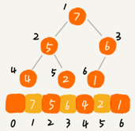
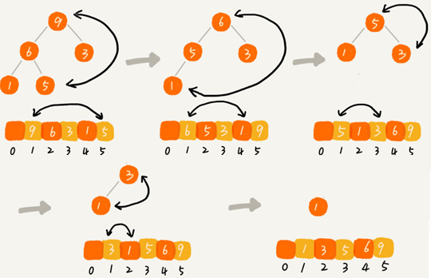
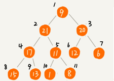
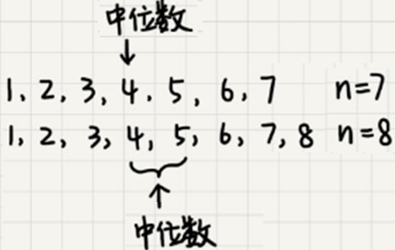
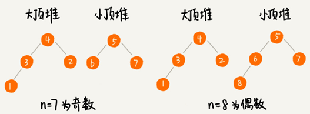
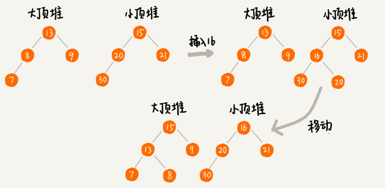

# 堆

# 堆的概念

堆是一种特殊的树:

- 堆是一个完全二叉树；
- 堆中每一个节点的值都必须大于等于（或小于等于）其子树中每个节点的值。

堆必须是一个完全二叉树，除了最后一层，其他层的节点个数都是满的，最后一层的节点都靠左排列。

堆中的每个节点的值必须大于等于（或者小于等于）其子树中每个节点的值。

对于每个节点的值都大于等于子树中每个节点值的堆叫“大顶堆”。

对于每个节点的值都小于等于子树中每个节点值的堆叫“小顶堆”。

对于同一组数据可以构建多种不同形态的堆。

堆是一种完全二叉树。它最大的特性是：每个节点的值都大于等于（或小于等于）其子树节点的值。因此，堆被分成了两类，大顶堆和小顶堆。

下图中1、2是大顶堆，3是小顶堆，4不是堆。


## 存储一个堆

完全二叉树比较适合用数组来存储。用数组来存储完全二叉树，不需要存储左右子节点的指针，单纯地通过数组的下标，就可以找到一个节点的左右子节点和父节点。



上图中i=1存储根节点，下标为 $i$ 的节点的左子节点就是下标为 $i∗2$ 的节点，右子节点就是下标为 $i∗2+1$的节点，父节点就是下标为 $\frac{i}{2}$ 的节点。

如果i=0存储根节点，下标为 $i$ 的节点的左子节点就是下标为 $i∗2+1$ 的节点，右子节点就是下标为 $i∗2+2$的节点，但父节点的下标为$\frac{i-1}{2}$

## 堆的基本操作

### 1. 插入一个元素

往堆中插入一个元素后需要继续满足堆的两个特性。

把新插入的元素直接放到堆的最后，之前的堆就不再符合堆的特性。就需要进行调整，让其重新满足堆的特性，这个过程叫作**堆化**（heapify）。

堆化有从下往上和从上往下两种方法。


堆化就是顺着节点所在的路径，向上或者向下进行对比，然后交换。从下往上堆化是让新插入的节点与父节点对比大小。如果不满足子节点小于等于父节点的大小关系，就互换两个节点。一直重复这个过程，直到比对到根节点。


java实现代码：

```java
public class Heap {
  private int[] a; // 数组，从下标 1 开始存储数据
  private int n;  // 堆可以存储的最大数据个数
  private int count; // 堆中已经存储的数据个数
 
  public Heap(int capacity) {
    a = new int[capacity + 1];
    n = capacity;
    count = 0;
  }
 
  public void insert(int data) {
    if (count >= n) return; // 堆满了
    ++count;
    a[count] = data;
    int i = count;
    while (i/2 > 0 && a[i] > a[i/2]) { // 自下往上堆化
      swap(a, i, i/2); // swap() 函数作用：交换下标为 i 和 i/2 的两个元素
      i = i/2;
    }
  }
 }
```

python代码：

```python
class Heap:
    def __init__(self):
        self.a = [None]  # 从下标 1 开始存储数据
        self.count = 0  # 堆中已经存储的数据个数

    def insert(self, data):
        self.count += 1
        if self.count == len(self.a):
            self.a.append(data)
        else:
            self.a[self.count] = data
        i = self.count
        while i >> 1 and self.a[i] > self.a[i >> 1]:
            self.a[i], self.a[i >> 1] = self.a[i >> 1], self.a[i]  # 交换下标为 i 和 i/2 的两个元素
            i = i >> 1
```


### 2. 删除堆顶元素

堆的任何节点的值都大于等于（或小于等于）子树节点的值，堆顶元素存储的就是堆中数据的最大值或者最小值。

大顶堆的堆顶元素就是最大的元素，删除堆顶元素之后，就需要把第二大的元素放到堆顶，那第二大元素肯定会出现在左右子节点中。然后我们再迭代地删除第二大节点，以此类推，直到叶子节点被删除。

但这样操作完成后的堆不再满足完全二叉树的特性：


可以先把最后一个节点放到堆顶，然后从上往下的堆化。这种方法堆化之后的结果，肯定满足完全二叉树的特性：


java代码：

```java
public void removeMax() {
  if (count == 0) return -1; // 堆中没有数据
  a[1] = a[count];
  --count;
  heapify(a, count, 1);
}
 
private void heapify(int[] a, int n, int i) { // 自上往下堆化
  while (true) {
    int maxPos = i;
    if (i*2 <= n && a[i] < a[i*2]) maxPos = i*2;
    if (i*2+1 <= n && a[maxPos] < a[i*2+1]) maxPos = i*2+1;
    if (maxPos == i) break;
    swap(a, i, maxPos);
    i = maxPos;
  }
}
```

python代码：

```python
    def remove_max(self):
        if self.count == 0:
            return
        self.a[1] = self.a[self.count]
        self.count -= 1
        heapify(self.a, self.count, 1)


def heapify(a: list, n: int, i: int):  # 自上往下堆化
    max_pos = i
    while True:
        if i * 2 <= n and a[i] < a[i * 2]:
            max_pos = i * 2
        if i * 2 + 1 <= n and a[max_pos] < a[i * 2 + 1]:
            max_pos = i * 2 + 1
        if max_pos == i:
            break
        a[i], a[max_pos] = a[max_pos], a[i]
        i = max_pos
```

一个包含 $n$ 个节点的完全二叉树高度小于 $log_{2}n$，堆化的时间复杂度跟树的高度成正比等于 $O(log\ n)$。插入数据和删除堆顶元素的主要逻辑就是堆化，所以，往堆中插入一个元素和删除堆顶元素的时间复杂度都是 $O(log\ n)$。

# 基于堆实现堆排序

借助于堆这种数据结构实现的排序算法，就叫作堆排序。这种排序方法的时间复杂度非常稳定，是 $O(nlog\  n)$，并且它还是原地排序算法。

堆排序的过程可以大致分解成两个大的步骤，**建堆**和**排序**。

## 1. 建堆

我们首先将数组原地建成一个堆。“原地”是指不借助另一个数组在原数组上操作。

建堆的两种思路：

1.假设起初堆中只包含一个数据，就是下标为 $1$ 的数据。然后调用插入操作，将下标从 $2$ 到 $n$ 的数据依次插入到堆中。整个过程都是从下到上的堆化。

2.从后往前处理数组，找到第一个第一个非叶子节点，然后依次从上往下堆化：


java代码：

```java
private static void buildHeap(int[] a, int n) {
  for (int i = n/2; i >= 1; --i) {
    heapify(a, n, i);
  }
}
 
private static void heapify(int[] a, int n, int i) {
  while (true) {
    int maxPos = i;
    if (i*2 <= n && a[i] < a[i*2]) maxPos = i*2;
    if (i*2+1 <= n && a[maxPos] < a[i*2+1]) maxPos = i*2+1;
    if (maxPos == i) break;
    swap(a, i, maxPos);
    i = maxPos;
  }
}
```

上述代码中从下标 $\frac{n}{2}$ 开始到 $1$ 的数据进行堆化，下标是 $\frac{n}{2}+1$ 到 $n$ 的节点是叶子节点不需要堆化。

对于完全二叉树来说，下标从$\frac{n}{2}+1$到 $n$ 的节点都是叶子节点。

建堆操作的时间复杂度：

叶子节点不需要堆化，所以需要堆化的节点从倒数第二层开始。每个节点堆化的过程中，需要比较和交换的节点个数，跟这个节点的高度 $k$ 成正比。将每个节点的高度求和，就可以得到建堆的时间复杂度。


将每个非叶子节点的高度求和：
$$
S_{1}=1 * h+2^{1} *(h-1)+2^{2} *(h-2)+\cdots+2^{k} *(h-k)+\cdots+2^{h-1} * 1
$$
把公式左右都乘以 $2$就得到公式 $S2$。将 $S2$ 错位对齐并减去 $S1$，可以得到 $S$：
$$
S_{1}=1*h+2^{1}*(h-1)+2^{2}*(h-2)+\cdots+2^{k}*(h-k)+\cdots+2^{h-1} * 1 \\
S_{2}=   2^{1}*h+    2^{2}*(h-1)+\cdots+2^{k}*(h-k+1)+\cdots+2^{h-1} * 2+2^h*1
$$

$$
S=S_{2}-S_{1} \\
=-h+2^{1}+2^{2}+2^{3}+\cdots+2^{k}+\cdots+2^{h-1}+2^{h} \\ 
=-h+\left(2^{h}-2\right)+2^{h}\\
=2^{h+1}-h-2
$$

因为 $h=log_2 n$，代入公式 $S$，就能得到 $S=O(n)$，所以，建堆的时间复杂度就是 $O(n)$。

## 2. 排序

建堆结束之后，数组中的数据已经是按照大顶堆的特性来组织的。数组中的第一个元素就是堆顶，也就是最大的元素。把它跟最后一个元素交换，那最大元素就放到了下标为 $n$ 的位置。

当堆顶元素移除之后，把下标为 $n$的元素放到堆顶，然后再通过堆化的方法，将剩下的 $n−1$ 个元素重新构建成堆。堆化完成之后再取堆顶的元素，放到下标是 $n−1$ 的位置，一直重复这个过程，直到最后堆中只剩下标为 $1$ 的一个元素，排序工作就完成了。



java代码：

```java
// n 表示数据的个数，数组 a 中的数据从下标 1 到 n 的位置。
public static void sort(int[] a, int n) {
  buildHeap(a, n);
  int k = n;
  while (k > 1) {
    swap(a, 1, k);
    --k;
    heapify(a, k, 1);
  }
}
```

现在，我们再来分析一下堆排序的时间复杂度、空间复杂度以及稳定性。

整个堆排序的过程，都只需要极个别临时存储空间，所以堆排序是原地排序算法。堆排序包括建堆和排序两个操作，建堆过程的时间复杂度是 $O(n)$，排序过程的时间复杂度是 $O(nlog \  n)$，所以，堆排序整体的时间复杂度是 $O(nlog \  n)$。

堆排序不是稳定的排序算法，因为在排序的过程，存在将堆的最后一个节点跟堆顶节点互换的操作，所以就有可能改变值相同数据的原始相对顺序。

上述实现中，堆中的数据是从数组下标为 1 的位置开始存储。

如果从 $0$ 开始存储，计算子节点和父节点的下标的公式就改变了。此时对于下标为i的节点，左子节点的下标是 $2∗i+1$，右子节点的下标是 $2∗i+2$，父节点的下标就是 $\frac{i-1}{2}$。

## 为什么快速排序要比堆排序性能好？

**第一点，堆排序跳跃访问方式对CPU缓存不友好**

对于快速排序来说，数据是顺序访问的。而对于堆排序来说，数据是跳着访问的。 比如，堆排序中，最重要的一个操作就是数据的堆化。比如下面这个例子，对堆顶节点进行堆化，会依次访问数组下标是 $1，2，4，8$的元素，而不是像快速排序那样，局部顺序访问，这样对 CPU 缓存是不友好的。



**第二点，对于同样的数据，在排序过程中，堆排序算法的数据交换次数要多于快速排序。**

快速排序数据交换的次数不会比逆序度多，但堆排序的第一步是建堆，建堆的过程会打乱数据原有的相对先后顺序，导致原数据的有序度降低。比如，对于一组已经有序的数据来说，经过建堆之后，数据反而变得更无序了。


# 堆的应用

堆这种数据结构的应用：优先级队列、求 Top K 和求中位数。

## 一：优先级队列

在优先级队列中，数据的出队顺序不是先进先出，而是按照优先级来，优先级最高的，最先出队。

用堆来实现一个优先级队列是最直接、最高效的。因为，堆和优先级队列非常相似。一个堆就可以看作一个优先级队列。往优先级队列中插入一个元素，就相当于往堆中插入一个元素；从优先级队列中取出优先级最高的元素，就相当于取出堆顶元素。

优先级队列的应用场景非常多，很多数据结构和算法都要依赖它。比如，赫夫曼编码、图的最短路径、最小生成树算法等等。很多语言都提供了优先级队列的实现，比如，Java 的 PriorityQueue，C++ 的 priority_queue 等。

优先级队列具体用法：

### 1. 合并有序小文件

假设有 100 个小文件，每个文件的大小是 100MB，每个文件中存储的都是有序的字符串。希望将这些 100 个小文件合并成一个有序的大文件。这里就会用到优先级队列。

整体思路类似于归并排序中的合并函数。从这 100 个文件中，各取第一个字符串，放入数组中，然后比较大小，把最小的那个字符串放入合并后的大文件中，并从数组中删除。

假设，这个最小的字符串来自于 13.txt 这个小文件，就再从这个小文件取下一个字符串，并且放到数组中，重新比较大小，并且选择最小的放入合并后的大文件，并且将它从数组中删除。依次类推，直到所有的文件中的数据都放入到大文件为止。

每次都从大小为100的数组中取最小字符串，都需要循环遍历整个数组，不是很高效。这里就可以用到优先级队列，也可以说是堆。

将从小文件中取出来的字符串放入到小顶堆中，那堆顶的元素就是最小的字符串，将这个字符串放入到大文件中，并将其从堆中删除。然后再从小文件中取出下一个字符串，放入到堆中。循环这个过程，就可以将 100 个小文件中的数据依次放入到大文件中。

在[07.排序-日志合并题](07.排序.md#日志合并题)中，我已经给出基本的顺序查找的实现，但现在本题从之前10个小文件增加到100个小文件，所以必须将数组改进为小根堆提高效率，下面是python实现：

```python
import os


def sort_key(x):
    return int(x[0])


def min_heapify(heap_arr: list, n: int, i: int, sort_key=sort_key):  # 自上往下堆化
    min_pos = i
    while True:
        if i * 2 <= n and sort_key(heap_arr[i]) > sort_key(heap_arr[i * 2]):
            min_pos = i * 2
        if i * 2 + 1 <= n and sort_key(heap_arr[min_pos]) > sort_key(heap_arr[i * 2 + 1]):
            min_pos = i * 2 + 1
        if min_pos == i:
            break
        heap_arr[i], heap_arr[min_pos] = heap_arr[min_pos], heap_arr[i]
        i = min_pos


fs = []
min_heap = [None]  # 堆从角标1开始存储数据
out = open("out.log", "w")
for i, filename in enumerate(os.listdir("../logs")):
    fo = open(os.path.join("../logs", filename))
    fs.append(fo)
    min_heap.append([fo.readline().rstrip(), i])
    j = i + 1
    while j >> 1 and sort_key(min_heap[j]) < sort_key(min_heap[j >> 1]):
        min_heap[j], min_heap[j >> 1] = min_heap[j >> 1], min_heap[j]  # 交换下标为 j 和 j/2 的两个元素
        j = j >> 1
count = len(fs)

while True:
    data, i = min_heap[1]
    out.write(data)
    out.write("\n")
    line = fs[i].readline().rstrip()
    if line:
        min_heap[1][0] = line
    else:
        min_heap[1] = min_heap[count]
        count -= 1
        fs[i].close()
        if count == 0: break
    # 自上往下堆化
    min_heapify(min_heap, count, 1, sort_key)

out.close()
```


### 2. 高性能定时器

有一个定时器中维护了很多定时任务，每个任务都设定了一个要触发执行的时间点。

| 2018.11.28.  17:30 | Task A |
| ------------------ | ------ |
| 2018.11.28.  19:20 | Task B |
| 2018.11.28.  15:31 | Task C |
| 2018.11.28.  13:55 | Task D |

按照任务设定的执行时间，将这些任务存储在优先级队列中，队列首部（也就是小顶堆的堆顶）存储的是最先执行的任务。

这样，定时器就不需要不断的去扫描任务列表了。它拿队首任务的执行时间点，与当前时间点相减，得到一个时间间隔 T。这个时间间隔 T 就是，从当前时间开始，需要等待多久，才会有第一个任务需要被执行。

这样，定时器就可以设定在 T 秒之后，再来执行任务。从当前时间点到（T-1）秒这段时间里，定时器都不需要做任何事情。

当 T 秒时间过去之后，定时器取优先级队列中队首的任务执行。然后再计算新的队首任务的执行时间点与当前时间点的差值，把这个值作为定时器执行下一个任务需要等待的时间。

这样，定时器既不用间隔 1 秒就轮询一次，也不用遍历整个任务列表，性能也就提高了。


## 二：利用堆求 Top K

维护一个 K 大小的小顶堆，将要求Top K的数据逐个取出与堆顶的元素对比，如果元素比堆顶元素大就把堆顶元素删除，并且将这个元素插入到堆中；如果比堆顶元素小，则不做处理。

用以上方法可以快速对动态数据计算出实时 Top K。

针对静态数据，只需要遍历静态数据逐个添加到小顶堆，静态数据都遍历完之后，堆中的数据就是前 K 大数据了。

python代码：

```python
class MinHeap:
    def __init__(self, k: int):
        self.heap_arr = [None] * (k + 1)  # 从下标 1 开始存储数据
        self.n = k
        self.count = 0  # 堆中已经存储的数据个数

    def insert(self, data):
        if self.count == self.n:
            if data > self.heap_arr[1]:
                self.heap_arr[1] = data
                self.heapify_up_to_down(1)
            return
        self.count += 1
        self.heap_arr[self.count] = data
        self.heapify_down_to_top(self.count)

    def heapify_down_to_top(self, i):
        # 从下往上堆化
        while i >> 1 and self.heap_arr[i] < self.heap_arr[i >> 1]:
            self.heap_arr[i], self.heap_arr[i >> 1] = self.heap_arr[i >> 1], self.heap_arr[i]  # 交换下标为 i 和 i/2 的两个元素
            i = i >> 1

    def heapify_up_to_down(self, i: int):  # 自上往下堆化
        min_pos = i
        while True:
            if i * 2 <= self.n and self.heap_arr[i] > self.heap_arr[i * 2]:
                min_pos = i * 2
            if i * 2 + 1 <= self.n and self.heap_arr[min_pos] > self.heap_arr[i * 2 + 1]:
                min_pos = i * 2 + 1
            if min_pos == i:
                break
            self.heap_arr[i], self.heap_arr[min_pos] = self.heap_arr[min_pos], self.heap_arr[i]
            i = min_pos


def topK(a: list, k: int) -> list:
    heap = MinHeap(k)
    for e in a:
        heap.insert(e)
    return heap.heap_arr[1:]


a = [0, 6, 3, 4, 0, 9, 2, 7, 5, -2, 8, 1, 6, 10]
print(topK(a, 4))
```


## 三：利用堆求中位数

把数据从小到大排列：

如果数据的个数是奇数，那第 $\frac{n}{2}+1$ 个数据是中位数；

如果数据的个数是偶数，第 $\frac{n}{2}$ 个和第 $\frac{n}{2}+1$ 个数据是中位数，可以取两个数中靠前的那个，就是第 $\frac{n}{2}$ 个数据作为中位数。



对于**静态数据**集合，中位数是固定的，先排序再直接返回这个固定的值就好了。

对于**动态数据**集合，中位数在不停地变动，如果每次询问中位数的时候，都要先进行排序代价很高。

借助堆这种数据结构，不用排序就可以快速求中位数：

维护两个堆，一个大顶堆，一个小顶堆。大顶堆中存储前半部分数据，小顶堆中存储后半部分数据，且小顶堆中的数据都大于大顶堆中的数据。

- 如果n 是偶数，大顶堆存储前$\frac{n}{2}$ 个数据，小顶堆中存储后 $\frac{n}{2}$ 个数据。
- 如果 n 是奇数，大顶堆存储前$\frac{n}{2}+1$ 个数据，小顶堆中存储后 $\frac{n}{2}$ 个数据。

其中大顶堆中的堆顶元素就是中位数：



添加一个数据：

- 如果新加入的数据小于等于大顶堆的堆顶元素，插入到大顶堆；
- 如果新加入的数据大于等于小顶堆的堆顶元素，插入到小顶堆。

这时候可能出现两个堆中的数据个数不符合前面约定的情况，可以从一个堆中不停地将堆顶元素移动到另一个堆，通过这样的调整，来让两个堆中的数据满足上面的约定。



插入数据因为需要涉及堆化时间复杂度为 $O(logn)$，求中位数只需要返回大顶堆的堆顶元素就可以时间复杂度是 $O(1)$。

利用两个堆求其他百分位的数据原理是类似的，中位数就是将数据从小到大排列，处于中间位置，就叫中位数，这个数据会大于等于前面 50% 的数据，99 百分位数就是大于前面 99% 数据的那个数据。

假设有 100 个数据，分别是 1，2，3，……，100，那 99 百分位数就是 99，因为小于等于 99 的数占总个数的 99%。


如果有 n 个数据，将数据从小到大排列之后，99 百分位数大约就是第 $n*99\%$ 个数据，同类，80 百分位数大约就是第 $n *80\%$ 个数据。

求 99 百分位数的思路：

维护两个堆，一个大顶堆，一个小顶堆。假设当前总数据的个数是 n，大顶堆中保存 $n*99\%$ 个数据，小顶堆中保存 $n*1\%$ 个数据。大顶堆堆顶的数据就是要找的 99 百分位数。

每插入一个数据，要判断这个数据跟大顶堆和小顶堆堆顶数据的大小关系，然后决定插入到哪个堆中。如果这个新插入的数据比大顶堆的堆顶数据小，那就插入大顶堆；如果这个新插入的数据比小顶堆的堆顶数据大，那就插入小顶堆。插入数据之后要重新计算，大顶堆和小顶堆中的数据个数是否还符合 99:1 这个比例。如果不符合，就将一个堆中的数据移动到另一个堆，直到满足这个比例。

每次插入数据会涉及几个数据的堆化操作，时间复杂度是 O(logn)。每次求 99 百分位数，直接返回大顶堆中的堆顶数据即可，时间复杂度是 O(1)。

python实现代码：

```python
import math

from Heap import Heap


class PercentileNumber:
    def __init__(self, percentile=0.5):
        self.min_heap = Heap(type="min")
        self.max_heap = Heap(type="max")
        self.count = 0
        self.percentile = percentile

    def insert(self, data):
        self.count += 1
        if self.count == 1:
            self.max_heap.insert(data)
            return
        max_count = math.ceil(self.count * self.percentile)
        if data <= self.max_heap.get_top():
            self.max_heap.insert(data)
        else:
            self.min_heap.insert(data)
        if max_count > len(self.max_heap):
            self.max_heap.insert(self.min_heap.remove_top())
        elif max_count < len(self.max_heap):
            self.min_heap.insert(self.max_heap.remove_top())

    def get_percentile_number(self):
        return self.max_heap.get_top()


number = PercentileNumber(percentile=0.5)
for i in range(1, 101):
    number.insert(i)
    print(number.get_percentile_number())
```

Heap类完整代码见github。


# 思考题

## 1.获取Top 10搜索关键词

**1.假设有一个包含 10 亿个搜索关键词的日志文件，如何快速获取到 Top 10 最热门的搜索关键词？**

搜索引擎每天会接收大量的用户搜索请求，它会把这些用户输入的搜索关键词记录下来，然后再离线地统计分析，得到最热门的 Top 10 搜索关键词。处理的场景限定为单机，可以使用的内存为 1GB。如何解决这个问题？

答：

假设 10 亿条搜索关键词中不重复的有 1 亿条，如果每个搜索关键词的平均长度是 50 个字节，那存储 1 亿个关键词起码需要 5GB 的内存空间，那就先将 10 亿条搜索关键词通过哈希算法分片到 10 个文件中。

遍历这 10 亿个关键词，通过某个哈希算法对其求哈希值，然后哈希值同 10 取模，得到的结果就是这个搜索关键词应该被分到的文件编号。

针对每个包含 1 亿条搜索关键词的文件，利用散列表和堆，分别求出 Top 10，然后把这个 10 个 Top 10 放在一块，然后取这 100 个关键词中，出现次数最多的 10 个关键词，这就是这 10 亿数据中的 Top 10 最频繁的搜索关键词了。

利用散列表和堆分别求出 Top 10的具体步骤：

先顺序扫描当前文件的搜索关键词。当扫描到某个关键词时，去散列表中查询。如果存在，我们就将对应的次数加一；如果不存在，我们就将它插入到散列表，并记录次数为 1。遍历完之后，散列表中就存储了不重复的搜索关键词以及出现的次数。

再建立一个大小为 10 的小顶堆，遍历散列表，依次取出每个搜索关键词及对应出现的次数，然后与堆顶的搜索关键词对比。如果出现次数比堆顶搜索关键词的次数多，那就删除堆顶的关键词，将这个出现次数更多的关键词加入到堆中。当遍历完整个散列表中的搜索关键词之后，堆中的搜索关键词就是出现次数最多的 Top 10 搜索关键词了。


## **2.定期统计点击量排名 Top 10 的新闻摘要**

有一个访问量非常大的新闻网站，我们希望将点击量排名 Top 10 的新闻摘要，滚动显示在网站首页 banner 上，并且每隔 1 小时更新一次。如果你是负责开发这个功能的工程师，你会如何来实现呢？

答：

以key为新闻id，value为点击量，建一个散列表，每当一个新闻被点击时，对应value+1，实时更新。

每隔1小时，重新建立一个大小为10的小顶堆（初始点击量为0）。遍历散列表，依次取出新闻id和点击量count，将取出的点击量count与堆顶元素的点击量count对比。如果取出的点击量count相对堆顶元素更大就删除堆顶的元素，并将从散列表取出新闻id和对应点击量加入到堆中。当遍历完整个散列表之后，堆中的新闻id就是出现次数最多的 Top 10 新闻id了。小顶堆创建完成后，即可将小顶堆里的10个新闻id覆盖写入到数据库中。


