# 动态规划基本问题

动态规划（Dynamic Programming）比较适合用来求解最优问题，比如求最大值、最小值等等。它可以非常显著地降低时间复杂度，提高代码的执行效率。

## 0-1背包问题

对于一组不同重量、不可分割的物品，选择一些装入背包，在满足背包最大重量限制的前提下，背包中物品总重量的最大值是多少呢？

关于这个问题，前面使用了回溯的解决方法，也就是穷举搜索所有可能的装法。假设背包的最大承载重量是 9。有 5 个不同的物品，重量分别是 2，2，4，6，3。

```java
// 回溯算法实现。注意：我把输入的变量都定义成了成员变量。
private int maxW = Integer.MIN_VALUE; // 结果放到 maxW 中
private int[] weight = {2，2，4，6，3};  // 物品重量
private int n = 5; // 物品个数
private int w = 9; // 背包承受的最大重量
public void f(int i, int cw) { // 调用 f(0, 0)
  if (cw == w || i == n) { // cw==w 表示装满了，i==n 表示物品都考察完了
    if (cw > maxW) maxW = cw;
    return;
  }
  f(i+1, cw); // 选择不装第 i 个物品
  if (cw + weight[i] <= w) {
    f(i+1,cw + weight[i]); // 选择装第 i 个物品
  }
}
```

用递归树画出来：

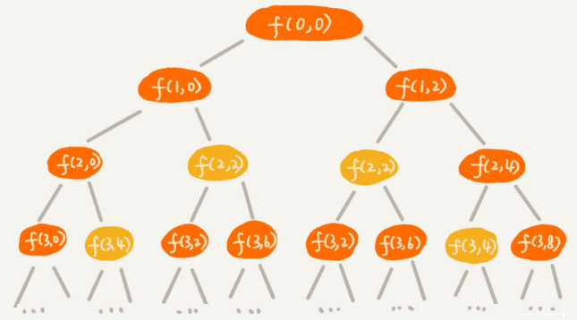

递归树中的每个节点表示一种状态用（i, cw）来表示。其中，i 表示将要决策第几个物品是否装入背包，cw 表示当前背包中物品的总重量。比如，（2，2）表示我们将要决策第 2 个物品是否装入背包，在决策前，背包中物品的总重量是 2。

递归树中，有些子问题的求解是重复的，比如图中 f(2, 2) 和 f(3,4) 都被重复计算了两次。这时可以借助“备忘录”的解决方式避免冗余计算。

```java
private int maxW = Integer.MIN_VALUE; // 结果放到 maxW 中
private int[] weight = {2，2，4，6，3};  // 物品重量
private int n = 5; // 物品个数
private int w = 9; // 背包承受的最大重量
private boolean[][] mem = new boolean[5][10]; // 备忘录，默认值 false
public void f(int i, int cw) { // 调用 f(0, 0)
  if (cw == w || i == n) { // cw==w 表示装满了，i==n 表示物品都考察完了
    if (cw > maxW) maxW = cw;
    return;
  }
  if (mem[i][cw]) return; // 重复状态
  mem[i][cw] = true; // 记录 (i, cw) 这个状态
  f(i+1, cw); // 选择不装第 i 个物品
  if (cw + weight[i] <= w) {
    f(i+1,cw + weight[i]); // 选择装第 i 个物品
  }
}
```

这种解决方法已经跟动态规划的执行效率基本上没有差别，再在来看看动态规划是怎么做的。

将整个求解过程分为n 个阶段，每个阶段会决策一个物品是否放到背包中。每个物品决策（放入或者不放入背包）完之后，背包中的物品的重量会有多种情况，即达到多种不同的状态，对应到递归树中，就是有很多不同的节点。

把每一层重复的状态（节点）合并，只记录不同的状态，然后基于上一层的状态集合，来推导下一层的状态集合。通过合并每一层重复的状态，保证每一层不同状态的个数都不会超过 w 个（w 表示背包的承载重量），从而避免每层状态个数的指数级增长。

用一个二维数组 $states[n][w+1]$，来记录每层可以达到的不同状态。

第 0 个（下标从 0 开始编号）物品的重量是 2，要么装入背包，要么不装入背包，决策完之后，会对应背包的两种状态，背包中物品的总重量是 0 或者 2。可用 $states[0][0]=true$ 和 $states[0][2]=true$ 来表示这两种状态。

第 1 个物品的重量也是 2，基于之前的背包状态，在这个物品决策完之后，不同的状态有 3 个，背包中物品总重量分别是 0(0+0)，2(0+2 or 2+0)，4(2+2)。用 $states[1][0]=true$，$states[1][2]=true$，$states[1][4]=true$ 来表示这三种状态。

考察完所有的物品后，整个 states 状态数组就都计算好了。图中 0 表示 false，1 表示 true。

在最后一层，找一个值为 true 的最接近 w（这里是 9）的值，就是背包中物品总重量的最大值。

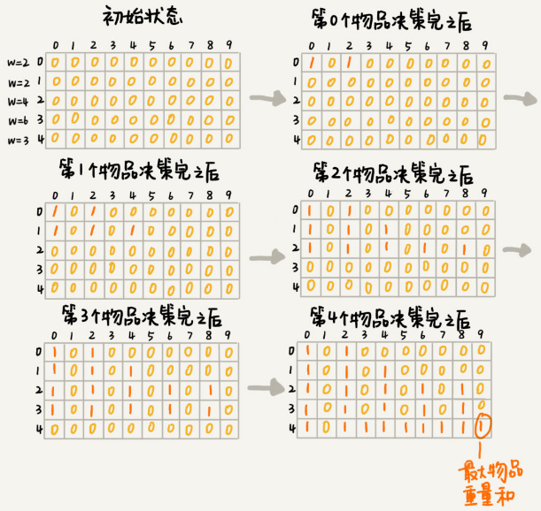

java代码：

```java
weight: 物品重量，n: 物品个数，w: 背包可承载重量
public int knapsack(int[] weight, int n, int w) {
  boolean[][] states = new boolean[n][w+1]; // 默认值 false
  states[0][0] = true;  // 第一行的数据要特殊处理，可以利用哨兵优化
  states[0][weight[0]] = true;
  for (int i = 1; i < n; ++i) { // 动态规划状态转移
    for (int j = 0; j <= w; ++j) {// 不把第 i 个物品放入背包
      if (states[i-1][j] == true) states[i][j] = states[i-1][j];
    }
    for (int j = 0; j <= w-weight[i]; ++j) {// 把第 i 个物品放入背包
      if (states[i-1][j]==true) states[i][j+weight[i]] = true;
    }
  }
  for (int i = w; i >= 0; --i) { // 输出结果
    if (states[n-1][i] == true) return i;
  }
  return 0;
}
```

这就是一种用动态规划解决问题的思路：把问题分解为多个阶段，每个阶段对应一个决策，然后记录每一个阶段可达的状态集合（去掉重复的），通过当前阶段的状态集合，来推导下一个阶段的状态集合，动态地往前推进。

用回溯算法解决这个问题的时间复杂度是 $O(2^n)$指数级的。而动态规划解决方案的时间复杂度是 O(n*w)，n 表示物品个数，w 表示背包可以承载的总重量。

假设有 10000 个物品，重量分布在 1 到 15000 之间，背包可以承载的总重量是 30000。如果用回溯算法解决，时间复杂度就是 2^10000，用动态规划解决时间复杂度就是 10000*30000。

上述代码实现额外申请一个 n 乘以 w+1 的二维数组，对空间的消耗比较多。但实际上只需要一个大小为 w+1 的一维数组就可以解决这个问题，动态规划状态转移的过程，都可以基于这个一维数组来操作：

```java
public static int knapsack2(int[] items, int n, int w) {
  boolean[] states = new boolean[w+1]; // 默认值 false
  states[0] = true;  // 第一行的数据要特殊处理，可以利用哨兵优化
  states[items[0]] = true;
  for (int i = 1; i < n; ++i) { // 动态规划
    for (int j = w-items[i]; j >= 0; --j) {// 把第 i 个物品放入背包
      if (states[j]==true) states[j+items[i]] = true;
    }
  }
  for (int i = w; i >= 0; --i) { // 输出结果
    if (states[i] == true) return i;
  }
  return 0;
}
```

注意：内层for循环j必须从大到小来处理，否则会出现 for 循环重复计算的问题。

python代码：

```python
def knapsack2(items_info: list, capacity: int) -> int:
    """
    固定容量的背包，计算能装进背包的物品组合的最大重量
    :param items_info: 每个物品的重量
    :param capacity: 背包容量
    :return: 最大装载重量
    """
    n = len(items_info)
    states = [False] * (capacity + 1)  # 总重量所有的可能是0~capacity，共capacity+1种情况
    states[0] = True  # 第0个物品不放入背包,此时背包重量为0
    # 第0个物品放入背包
    if items_info[0] <= capacity:
        states[items_info[0]] = True
    for i in range(1, n):
        wi = items_info[i]  # 背包中第i个物品的重量
        # 重量最大值为capacity,需确保重量j在放入wi后，总重量依然小于等于capacity
        for j in range(capacity - wi, -1, -1):
            if states[j]: states[j + wi] = True
    for i in range(capacity, -1, -1):
        if states[i]: return i
    return 0
```

## 0-1背包问题升级版

上面的背包问题只涉及背包重量和物品重量。现在引入物品价值这一变量。对于一组不同重量、不同价值、不可分割的物品，选择将某些物品装入背包，在满足背包最大重量限制的前提下，背包中可装入物品的总价值最大是多少呢？

回溯算法解决的代码：

```java
private int maxV = Integer.MIN_VALUE; // 结果放到 maxV 中
private int[] items = {2，2，4，6，3};  // 物品的重量
private int[] value = {3，4，8，9，6}; // 物品的价值
private int n = 5; // 物品个数
private int w = 9; // 背包承受的最大重量
public void f(int i, int cw, int cv) { // 调用 f(0, 0, 0)
  if (cw == w || i == n) { // cw==w 表示装满了，i==n 表示物品都考察完了
    if (cv > maxV) maxV = cv;
    return;
  }
  f(i+1, cw, cv); // 选择不装第 i 个物品
  if (cw + weight[i] <= w) {
    f(i+1,cw+weight[i], cv+value[i]); // 选择装第 i 个物品
  }
}
```

针对上面的代码，画出递归树。每个节点表示一个状态，用 3 个变量（i, cw, cv）来表示一个状态。其中，i 表示即将要决策第 i 个物品是否装入背包，cw 表示当前背包中物品的总重量，cv 表示当前背包中物品的总价值。

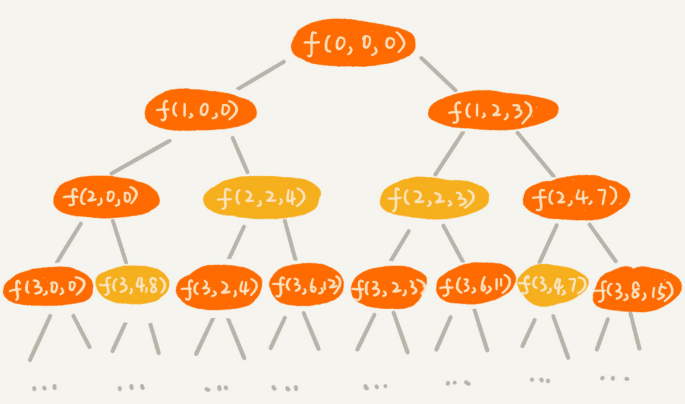

在递归树中，有几个节点的 i 和 cw 是完全相同的，比如 f(2,2,4) 和 f(2,2,3)。在背包中物品总重量一样的情况下，f(2,2,4) 这种状态对应的物品总价值更大，所以可以舍弃 f(2,2,3) 这种状态，只沿着 f(2,2,4) 这条决策路线继续往下决策。也就是说，对于 (i, cw) 相同的不同状态，只需要保留 cv 值最大的那个，继续递归处理，其他状态不予考虑。如果用回溯算法，这个问题就没法再用“备忘录”解决了。

看看动态规划，把整个求解过程分为 n 个阶段，每个阶段会决策一个物品是否放到背包中。每个阶段决策完之后，背包中的物品的总重量以及总价值，会有多种情况，也就是会达到多种不同的状态。

用一个二维数组 $states[n][w+1]$，来记录每层可以达到的不同状态，数组存储当前状态对应的最大总价值。

把每一层中 (i, cw) 重复的状态（节点）合并，只记录 cv 值最大的那个状态，然后基于这些状态来推导下一层的状态。

这个动态规划的过程的java代码：

```java
public static int knapsack3(int[] weight, int[] value, int n, int w) {
  int[][] states = new int[n][w+1];
  for (int i = 0; i < n; ++i) { // 初始化 states
    for (int j = 0; j < w+1; ++j) {
      states[i][j] = -1;
    }
  }
  states[0][0] = 0;
  states[0][weight[0]] = value[0];
  for (int i = 1; i < n; ++i) { // 动态规划，状态转移
    for (int j = 0; j <= w; ++j) { // 不选择第 i 个物品
      if (states[i-1][j] >= 0) states[i][j] = states[i-1][j];
    }
    for (int j = 0; j <= w-weight[i]; ++j) { // 选择第 i 个物品
      if (states[i-1][j] >= 0) {
        int v = states[i-1][j] + value[i];
        if (v > states[i][j+weight[i]]) {
          states[i][j+weight[i]] = v;
        }
      }
    }
  }
  // 找出最大值
  int maxvalue = -1;
  for (int j = 0; j <= w; ++j) {
    if (states[n-1][j] > maxvalue) maxvalue = states[n-1][j];
  }
  return maxvalue;
}
```

上述代码时间复杂度和空间复杂度都是 $O(n*w)$。空间复杂度可以优化为$O(w)$，python代码：

```python
def knapsack3(weight: list, value: list, capacity: int):
    """
    最大承重限制下，计算能装进背包的物品组合的最大价值
    :param weight:每个物品的重量
    :param value:每个物品的价值
    :param capacity:背包最大承重
    :return:最大承重限制下的最大价值
    """
    n = len(weight)
    states = [-1] * (capacity + 1)  # 总重量所有的可能是0~capacity，共capacity+1种情况
    states[0] = 0  # 第0个物品不放入背包,此时背包价值为0
    # 第0个物品放入背包
    if weight[0] <= capacity:
        states[weight[0]] = value[0]
    for i in range(1, n):
        wi = weight[i]  # 背包中第i个物品的重量
        # 重量最大值为capacity,需确保重量j在放入wi后，总重量依然小于等于capacity
        for j in range(capacity - wi, -1, -1):
            if states[j] != -1:
                v = states[j] + value[i]
                if v > states[j + wi]: states[j + wi] = v
    # 返回最大价值
    return max(states)
```

## 双11购物的凑单问题

淘宝的“双十一”购物节有各种促销活动，比如“满 200 元减 50 元”。假设你女朋友的购物车中有 n 个（n>100）想买的商品，她希望从里面选几个，在凑够满减条件的前提下，让选出来的商品价格总和最大程度地接近满减条件（200 元），如何运用动态规划的思想编程解决这个问题？

思路：

动态规划，购物车中有 n 个商品，针对每个商品都决策是否购买。每次决策之后，对应不同的状态集合。用一个二维数组 $states[n][x]$，来记录每次决策之后所有可达的状态。

对于这个问题来说，要找的是大于等于 200（满减条件）的值中最小的，所以就不能设置为 200 加 1 了。就这个实际的问题而言，如果要购买的物品的总价格超过 200 太多，比如 1000，那这个羊毛“薅”得就没有太大意义了。所以，可以限定 x 值为 1001。

求出大于等于 200 的总价格中的最小的，还要找出这个最小总价格对应都要购买哪些商品。可以利用 states 数组，倒推出这个被选择的商品序列。

java代码：

```java
// items 商品价格，n 商品个数, w 表示满减条件，比如 200
public static void double11advance(int[] items, int n, int w) {
  boolean[][] states = new boolean[n][3*w+1];// 超过 3 倍就没有薅羊毛的价值了
  states[0][0] = true;  // 第一行的数据要特殊处理
  states[0][items[0]] = true;
  for (int i = 1; i < n; ++i) { // 动态规划
    for (int j = 0; j <= 3*w; ++j) {// 不购买第 i 个商品
      if (states[i-1][j] == true) states[i][j] = states[i-1][j];
    }
    for (int j = 0; j <= 3*w-items[i]; ++j) {// 购买第 i 个商品
      if (states[i-1][j]==true) states[i][j+items[i]] = true;
    }
  }
 
  int j;
  for (j = w; j < 3*w+1; ++j) { 
    if (states[n-1][j] == true) break; // 输出结果大于等于 w 的最小值
  }
  if (j == 3*w+1) return; // 没有可行解
  for (int i = n-1; i >= 1; --i) { // i 表示二维数组中的行，j 表示列
    if(j-items[i] >= 0 && states[i-1][j-items[i]] == true) {
      System.out.print(items[i] + " "); // 购买这个商品
      j = j - items[i];
    } // else 没有购买这个商品，j 不变。
  }
  if (j != 0) System.out.print(items[0]);
}
```

利用 states 数组倒推选择购买了哪些商品的方法：

状态 (i, j) 只有可能从 (i-1, j) 或者 (i-1, j-value[i]) 两个状态推导过来。所以，我们就检查这两个状态是否是可达的，也就是 $states[i-1][j]$ 或者 $states[i-1][j-value[i]]$ 是否是 true。

如果 $states[i-1][j]$ 可达，就说明我们没有选择购买第 i 个商品，如果 $states[i-1][j-value[i]]$ 可达，那就说明选择了购买第 i 个商品。从中选择一个可达的状态（如果两个都可达，就随意选择一个），然后，继续迭代地考察其他商品是否有选择购买。

python代码：

```python
def double11advance(items_info: list, w: int):
    """
    动态规划解决双11凑单问题
    :param items_info: 每个商品价格
    :param w: 满减条件，比如 200
    :return:
    """
    n = len(items_info)
    # 超过 3 倍就没有薅羊毛的价值了
    states = [[False] * (3 * w + 1) for i in range(n)]
    states[0][0] = True
    states[0][items_info[0]] = True
    for i in range(1, n):
        for j in range(3 * w + 1):
            if states[i - 1][j]:
                # 不购买第i个商品
                states[i][j] = states[i - 1][j]
                # 购买第i个商品
                nw = j + items_info[i]
                if nw <= 3 * w:
                    states[i][nw] = True
    j = w
    while j < 3 * w + 1 and not states[n - 1][j]:
        j += 1
    # j是大于等于 w 的最小值
    if j == 3 * w + 1: return  # 没有可行解
    for i in range(n - 1, 0, -1):
        if j - items_info[i] >= 0 and states[i - 1][j - items_info[i]]:
            print(items_info[i], end=" ")
            j -= items_info[i]
    if j != 0: print(items_info[0], end="")
    print()
```

## 回溯算法解决双11购物凑单问题

python实现：

```python
def double11advance_back_track(i: int, cp: int, items: list, p: int):
    """
    回溯算法解决双11凑单问题
    :param i: 当前商品的索引
    :param cp: 选购的商品总价格
    :param items: 每个商品的价格
    :param p: 满减条件，比如 200
    :return:
    """
    global min_w, mem, picks
    n = len(items)
    # 已经考察完所有的物品 或 选购的商品总价格已经超过最小值
    if i == n or cp >= min_w:
        if p <= cp < min_w:
            global picks_with_min_value
            min_w = cp
            picks_with_min_value = [items[i] for i in range(n) if picks[i]]
        return
    # 当前状态若已经计算则不计算，未计算则记录当前状态避免下次重复计算
    if (i, cp) in mem: return
    mem.add((i, cp))

    # 不选第i个商品
    picks[i] = False
    double11advance_back_track(i + 1, cp, items, p)
    # 选第i个商品
    picks[i] = True
    double11advance_back_track(i + 1, cp + items[i], items, p)


def double11advance2(items: list, w: int) -> list:
    global mem, picks, min_w, picks_with_min_value
    # 存储背包中物品总重量的最小值
    min_w = sys.maxsize
    # 背包选取的物品列表
    picks_with_min_value = []
    picks = [False] * len(items)
    mem = set()
    double11advance_back_track(0, 0, items, w)
    return picks_with_min_value
```


# 动态规划理论

“一个模型”指的是，问题可以抽象成分阶段决策最优解模型。“三个特征”指的是最优子节、无后效性和重复子问题。

两种动态规划的解题思路，分别是状态转移表法和状态转移方程法。其中，状态转移表法解题思路大致可以概括为，**回溯算法实现 - 定义状态 - 画递归树 - 找重复子问题 - 画状态转移表 - 根据递推关系填表 - 将填表过程翻译成代码**。状态转移方程法的大致思路可以概括为，**找最优子结构 - 写状态转移方程 - 将状态转移方程翻译成代码**。

## 一个模型三个特征

“**一个模型**”指的是动态规划适合解决的问题的模型，即“**多阶段决策最优解模型**”。

用动态规划来解决最优问题的过程需要经历多个决策阶段。每个决策阶段都对应着一组状态。然后寻找一组决策序列，经过这组决策序列，能够产生最终期望求解的最优值。

“**三个特征**”是**最优子结构**、**无后效性**和**重复子问题**。

### 1. 最优子结构

最优子结构指的是，问题的最优解包含子问题的最优解。可以通过子问题的最优解，推导出问题的最优解。

最优子结构，对应到动态规划问题模型上，也可以理解为后面阶段的状态可以通过前面阶段的状态推导出来。

### 2. 无后效性

无后效性有两层含义：

1.在推导后面阶段的状态的时候，只关心前面阶段的状态值，不关心这个状态是怎么一步一步推导出来的。

2.某阶段状态一旦确定，就不受之后阶段的决策影响。

### 3. 重复子问题

不同的决策序列，到达某个相同的阶段时，可能会产生重复的状态。

## 实例剖析

假设有一个 n * n 的矩阵 $w[n][n]$，矩阵存储的都是正整数。棋子起始位置在左上角，终止位置在右下角。将棋子从左上角移动到右下角。每次只能向右或者向下移动一位。从左上角到右下角，会有很多不同的路径可以走。把每条路径经过的数字加起来看作路径的长度。那从左上角移动到右下角的最短路径长度是多少呢？

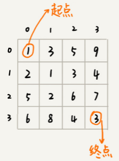

**这个问题是否符合“一个模型”？**

从 (0, 0) 走到 (n-1, n-1)，总共要走 $2*(n-1)$ 步，也就对应着 $2*(n-1)$个阶段。每个阶段都有向右走或者向下走两种决策，并且每个阶段都会对应一个状态集合。

把状态定义为 min_dist(i, j)，其中 i 表示行，j 表示列。min_dist 表达式的值表示从 (0, 0) 到达 (i, j) 的最短路径长度。所以，这个问题是一个多阶段决策最优解问题，符合动态规划的模型。

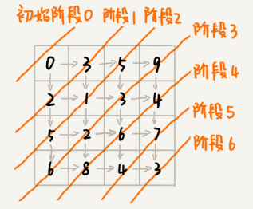

**这个问题是否符合“三个特征”？**

从左上角到节点对应的位置，有多种路线，这也能说明这个问题中存在重复子问题。

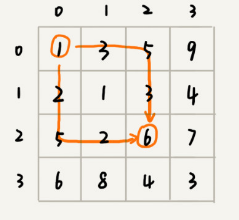

如果走到 (i, j) 这个位置，只能通过 (i-1, j)，(i, j-1) 这两个位置移动过来，即要计算 (i, j) 位置对应的状态，只需要关心 (i-1, j)，(i, j-1) 两个位置对应的状态，并不关心棋子是通过什么样的路线到达这两个位置的。

这个问题仅仅允许往下和往右移动，不允许后退，所以，前面阶段的状态确定之后，不会被后面阶段的决策所改变，所以符合“无后效性”这一特征。

因为只能往右或往下移动，所以只有可能从 (i, j-1) 或者 (i-1, j) 两个位置到达 (i, j)。即到达 (i, j) 的最短路径要么经过 (i, j-1)，要么经过 (i-1, j)。换句话说就是，min_dist(i, j) 可以通过 min_dist(i, j-1) 和 min_dist(i-1, j) 两个状态推导出来。这就说明，这个问题符合“最优子结构”。

```java
min_dist(i, j) = w[i][j] + min(min_dist(i, j-1), min_dist(i-1, j))
```

**两种动态规划解题思路:**

解决动态规划问题，一般有状态转移表法和状态转移方程法两种思路。

### 1. 状态转移表法

一般能用动态规划解决的问题，都可以使用回溯算法的暴力搜索解决。所以可以先用简单的回溯算法解决，然后定义状态，每个状态表示一个节点，画出对应的递归树。从递归树中，可以很容易看出来是否存在重复子问题，以及重复子问题是如何产生的。以此来寻找规律，看是否能用动态规划解决。

找到重复子问题之后，接下来有两种处理思路，第一种是直接用**回溯加“备忘录”**的方法，来避免重复子问题。从执行效率上来讲，这跟动态规划的解决思路没有差别。第二种是使用动态规划的解决方法，**状态转移表法**。

先画出一个状态表。状态表一般都是二维的。其中，每个状态包含三个变量，行、列、数组值。根据决策的先后过程，从前往后，根据递推关系，分阶段填充状态表中的每个状态。最后，将这个递推填表的过程，翻译成代码，就是动态规划代码了。

尽管大部分状态表都是二维的，但是如果问题的状态比较复杂，需要很多变量来表示，那对应的状态表可能就是高维的，比如三维、四维。那这个时候就不适合用状态转移表法来解决了。一方面是因为高维状态转移表不好画图表示，另一方面是因为人脑确实很不擅长思考高维的东西。

如何套用状态转移表法，来解决上面的矩阵最短路径的问题？

先用回溯算法穷举出所有走法：

```java
private int minDist = Integer.MAX_VALUE; // 全局变量或者成员变量
// 调用方式：minDistBacktracing(0, 0, 0, w, n);
public void minDistBT(int i, int j, int dist, int[][] w, int n) {
  // 到达了 n-1, n-1 这个位置了，这里看着有点奇怪哈，你自己举个例子看下
  if (i == n && j == n) {
    if (dist < minDist) minDist = dist;
    return;
  }
  if (i < n) { // 往下走，更新 i=i+1, j=j
    minDistBT(i + 1, j, dist+w[i][j], w, n);
  }
  if (j < n) { // 往右走，更新 i=i, j=j+1
    minDistBT(i, j+1, dist+w[i][j], w, n);
  }
}
```

有了回溯代码之后，再画出递归树，以此来寻找重复子问题。在递归树中，一个状态（也就是一个节点）包含三个变量 (i, j, dist)，其中 i，j 分别表示行和列，dist 表示从起点到达 (i, j) 的路径长度。图中，尽管 (i, j, dist) 不存在重复的，但是 (i, j) 重复的有很多。对于 (i, j) 重复的节点，只需要选择 dist 最小的节点，继续递归求解，其他节点就可以舍弃了。

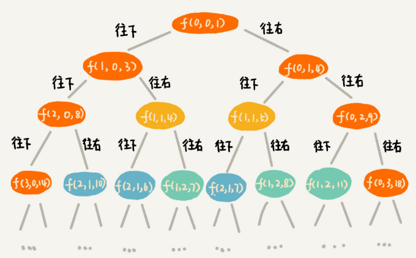

既然存在重复子问题，就可以尝试用动态规划来解决。

画出一个二维状态表，表中的行、列表示棋子所在的位置，表中的数值表示从起点到这个位置的最短路径。我们按照决策过程，通过不断状态递推演进，将状态表填好：

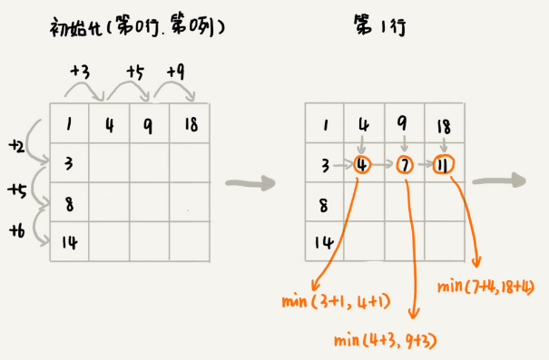

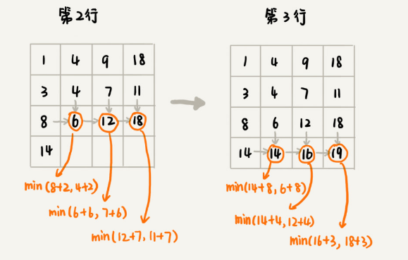

java代码：

```java
public int minDistDP(int[][] matrix, int n) {
  int[][] states = new int[n][n];
  int sum = 0;
  for (int j = 0; j < n; ++j) { // 初始化 states 的第一行数据
    sum += matrix[0][j];
    states[0][j] = sum;
  }
  sum = 0;
  for (int i = 0; i < n; ++i) { // 初始化 states 的第一列数据
    sum += matrix[i][0];
    states[i][0] = sum;
  }
  for (int i = 1; i < n; ++i) {
    for (int j = 1; j < n; ++j) {
      states[i][j] = 
            matrix[i][j] + Math.min(states[i][j-1], states[i-1][j]);
    }
  }
  return states[n-1][n-1];
}
```

python代码：

```python
def min_dist_DP(matrix: List[List[int]]) -> int:
    m, n = len(weights), len(weights[0])
    states = [[0] * n for _ in range(m)]
    sum = 0
    for j in range(n):
        sum += matrix[0][j]
        states[0][j] = sum
    sum = 0
    for i in range(n):
        sum += matrix[i][0]
        states[i][0] = sum
    for i in range(1, n):
        for j in range(1, n):
            states[i][j] = matrix[i][j] + min(states[i][j - 1], states[i - 1][j])
    return states[-1][-1]
```


### 2. 状态转移方程法

状态转移方程法有点类似递归的解题思路，需要分析某个问题如何通过子问题来递归求解，也就是所谓的最优子结构。根据最优子结构，写出递归公式，也就是所谓的状态转移方程。有了状态转移方程，代码实现就非常简单了。一般情况下有**递归加“备忘录”**和**迭代递推**两种代码实现方法。

状态转移方程：

```java
min_dist(i, j) = w[i][j] + min(min_dist(i, j-1), min_dist(i-1, j))
```

如果能写出**状态转移方程**，那动态规划问题基本上就解决一大半了，而翻译成代码非常简单。但是很多动态规划问题的状态本身就不好定义，状态转移方程也就更不好想到。

下面用递归加“备忘录”的方式，将状态转移方程翻译成java代码：

```java
private int[][] matrix = 
         {{1，3，5，9}, {2，1，3，4}，{5，2，6，7}，{6，8，4，3}};
private int n = 4;
private int[][] mem = new int[4][4];
public int minDist(int i, int j) { // 调用 minDist(n-1, n-1);
  if (i == 0 && j == 0) return matrix[0][0];
  if (mem[i][j] > 0) return mem[i][j];
  int minLeft = Integer.MAX_VALUE;
  if (j-1 >= 0) {
    minLeft = minDist(i, j-1);
  }
  int minUp = Integer.MAX_VALUE;
  if (i-1 >= 0) {
    minUp = minDist(i-1, j);
  }
  
  int currMinDist = matrix[i][j] + Math.min(minLeft, minUp);
  mem[i][j] = currMinDist;
  return currMinDist;
}
```

python代码：

```python
def min_dist(matrix: List[List[int]]):
    m, n = len(matrix), len(matrix[0])
    mem = [[0] * n for _ in range(m)]

    def min_dist_in(i: int, j: int):
        if i == j == 0: return matrix[0][0]
        if mem[i][j]: return mem[i][j]
        if i < 0 or j < 0: return sys.maxsize
        curr_min_dist = matrix[i][j] + min(min_dist_in(i, j - 1), min_dist_in(i - 1, j))
        mem[i][j] = curr_min_dist
        return curr_min_dist

    return min_dist_in(m - 1, n - 1)
```

不是每个问题都同时适合这两种解题思路。有的问题可能用第一种思路更清晰，而有的问题可能用第二种思路更清晰，所以要结合具体的情况具体分析，到底选择用哪种解题思路。

## 贪心/分治/回溯和动态规划的区别和联系

贪心、回溯、动态规划都可以抽象成**多阶段决策最优解模型**，而分治单独尽管大部分也是最优解问题却都不能抽象成多阶段决策模型。

回溯算法是个“万金油”。基本上能用的动态规划、贪心解决的问题都可以用回溯算法解决。回溯算法相当于穷举搜索。穷举所有的情况，然后对比得到最优解。不过，回溯算法的时间复杂度非常高，是指数级别的，只能用来解决小规模数据的问题。对于大规模数据的问题，用回溯算法解决的执行效率就很低了。

能用动态规划解决的问题，需要满足最优子结构、无后效性和重复子问题三个特征。在重复子问题这一点上，动态规划和分治算法的区分非常明显。分治算法要求分割成的子问题，不能有重复子问题，而动态规划正好相反。

贪心算法实际上是动态规划算法的一种特殊情况。它解决问题起来更加高效，代码实现也更加简洁。不过，它可以解决的问题也更加有限。它能解决的问题需要满足三个条件，最优子结构、无后效性和贪心选择性。“贪心选择性”的意思是，通过局部最优的选择，能产生全局的最优选择。每一个阶段，我们都选择当前看起来最优的决策，所有阶段的决策完成之后，最终由这些局部最优解构成全局最优解。

解决复杂算法问题的小技巧：

**先单纯考虑“人脑”会如何去解决这个问题**，把抽象问题具象化，实例化几个测试数据，通过人脑去分析具体实例的解，然后总结规律，再尝试套用学过的算法，看是否能够解决。

再就是要**多练**，做多了题目之后，自然就会有感觉，看到问题，立马就能想到能否用动态规划解决，然后直接就可以寻找最优子结构，写出动态规划方程，然后将状态转移方程翻译成代码。


# 搜索引擎中的拼写纠错功能

利用 Trie 树，可以实现搜索引擎的关键词提示功能。实际上在搜索框中，一不小心输错单词时，搜索引擎会非常智能地检测出你的拼写错误，并且用对应的正确单词来进行搜索。

## 如何量化两个字符串的相似度？

量化两个字符串之间的相似程度，有一个非常著名的量化方法是编辑距离（Edit Distance）。

**编辑距离**指将一个字符串转化成另一个字符串，需要的最少编辑操作次数（比如增加一个字符、删除一个字符、替换一个字符）。编辑距离越大，说明两个字符串的相似程度越小；相反，编辑距离就越小，说明两个字符串的相似程度越大。对于两个完全相同的字符串来说，编辑距离就是 0。

根据所包含的编辑操作种类的不同，编辑距离有多种不同的计算方式，比较著名的有**莱文斯坦距离**（Levenshtein distance）和**最长公共子串长度**（Longest common substring length）。其中，莱文斯坦距离允许增加、删除、替换字符这三个编辑操作，最长公共子串长度只允许增加、删除字符这两个编辑操作。

莱文斯坦距离的大小，表示两个字符串差异的大小；而最长公共子串的大小，表示两个字符串相似程度的大小。

下面这两个字符串 mitcmu 和 mtacnu 的莱文斯坦距离是 3，最长公共子串长度是 4。

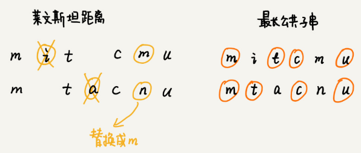

了解了编辑距离的概念之后，我们来看，如何快速计算两个字符串之间的编辑距离？

## 如何编程计算莱文斯坦距离？

这个问题是求把一个字符串变成另一个字符串，需要的最少编辑次数。整个求解过程，涉及多个决策阶段，需要依次考察一个字符串中的每个字符，跟另一个字符串中的字符是否匹配，匹配的话如何处理，不匹配的话又如何处理。所以，这个问题符合**多阶段决策最优解模型**。

先用回溯算法尝试。如果 a[i] 与 b[j] 匹配，继续递归考察 a[i+1] 和 b[j+1]。如果 a[i] 与 b[j] 不匹配，有多种处理方式可选：

- 删除 a[i]，然后递归考察 a[i+1] 和 b[j]；
- 删除 b[j]，然后递归考察 a[i] 和 b[j+1]；
- 在 a[i] 前面添加一个跟 b[j] 相同的字符，然后递归考察 a[i] 和 b[j+1];
- 在 b[j] 前面添加一个跟 a[i] 相同的字符，然后递归考察 a[i+1] 和 b[j]；
- 将 a[i] 替换成 b[j]，或者将 b[j] 替换成 a[i]，然后递归考察 a[i+1] 和 b[j+1]。

java代码：

```java
private char[] a = "mitcmu".toCharArray();
private char[] b = "mtacnu".toCharArray();
private int n = 6;
private int m = 6;
private int minDist = Integer.MAX_VALUE; // 存储结果
// 调用方式 lwstBT(0, 0, 0);
public lwstBT(int i, int j, int edist) {
  if (i == n || j == m) {
    if (i < n) edist += (n-i);
    if (j < m) edist += (m - j);
    if (edist < minDist) minDist = edist;
    return;
  }
  if (a[i] == b[j]) { // 两个字符匹配
    lwstBT(i+1, j+1, edist);
  } else { // 两个字符不匹配
    lwstBT(i + 1, j, edist + 1); // 删除 a[i] 或者 b[j] 前添加一个字符
    lwstBT(i, j + 1, edist + 1); // 删除 b[j] 或者 a[i] 前添加一个字符
    lwstBT(i + 1, j + 1, edist + 1); // 将 a[i] 和 b[j] 替换为相同字符
  }
}
```

根据回溯算法的代码实现，可以画出递归树分析是否存在重复子问题。如果存在重复子问题，那就可以考虑能否用动态规划来解决；如果不存在重复子问题，那回溯就是最好的解决方法。

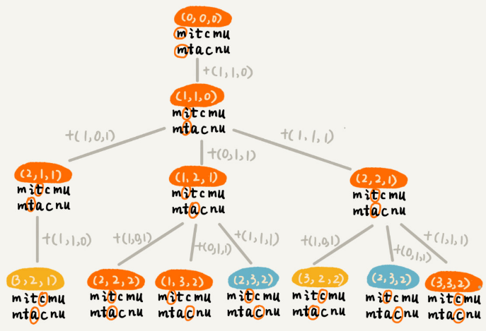

在递归树中，每个节点代表一个状态，状态包含三个变量 (i, j, edist)，其中，edist 表示处理到 a[i] 和 b[j] 时，已经执行的编辑操作的次数。

在递归树中，(i, j) 两个变量重复的节点很多，比如 (3, 2) 和 (2, 3)。对于 (i, j) 相同的节点，只需要保留 edist 最小的，继续递归处理就可以了，剩下的节点都可以舍弃。所以，状态就从 (i, j, edist) 变成了 (i, j, min_edist)，其中 min_edist 表示处理到 a[i] 和 b[j]，已经执行的最少编辑次数。

反过来考虑，状态 (i, j) 可能从 (i-1, j)，(i, j-1)，(i-1, j-1) 三个状态中的任意一个转移过来：

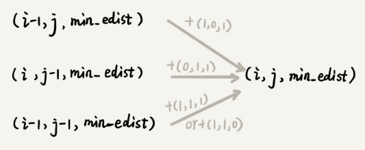

状态转移方程：

```
如果：a[i]!=b[j]，min_edist(i, j)=
min(min_edist(i-1,j)+1, min_edist(i,j-1)+1, min_edist(i-1,j-1)+1)
 
如果：a[i]==b[j]，min_edist(i, j)=
min(min_edist(i-1,j)+1, min_edist(i,j-1)+1，min_edist(i-1,j-1))
```

根据状态之间的递推关系，可画出一个二维的状态表，按行依次来填充状态表中的每个值。

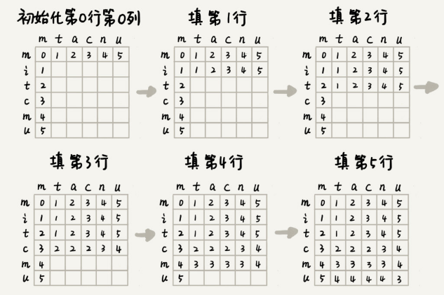

java代码：

```java
public int lwstDP(char[] a, int n, char[] b, int m) {
  int[][] minDist = new int[n][m];
  for (int j = 0; j < m; ++j) { // 初始化第 0 行:a[0..0] 与 b[0..j] 的编辑距离
    if (a[0] == b[j]) minDist[0][j] = j;
    else if (j != 0) minDist[0][j] = minDist[0][j-1]+1;
    else minDist[0][j] = 1;
  }
  for (int i = 0; i < n; ++i) { // 初始化第 0 列:a[0..i] 与 b[0..0] 的编辑距离
    if (a[i] == b[0]) minDist[i][0] = i;
    else if (i != 0) minDist[i][0] = minDist[i-1][0]+1;
    else minDist[i][0] = 1;
  }
  for (int i = 1; i < n; ++i) { // 按行填表
    for (int j = 1; j < m; ++j) {
      if (a[i] == b[j]) minDist[i][j] = min(
          minDist[i-1][j]+1, minDist[i][j-1]+1, minDist[i-1][j-1]);
      else minDist[i][j] = min(
          minDist[i-1][j]+1, minDist[i][j-1]+1, minDist[i-1][j-1]+1);
    }
  }
  return minDist[n-1][m-1];
}
 
private int min(int x, int y, int z) {
  int minv = Integer.MAX_VALUE;
  if (x < minv) minv = x;
  if (y < minv) minv = y;
  if (z < minv) minv = z;
  return minv;
}
```

python代码：

```python
def lwst_dp(a: str, b: str) -> int:
    """
    如果：a[i]!=b[j]，min_edist(i, j)=
    min(min_edist(i-1,j)+1, min_edist(i,j-1)+1, min_edist(i-1,j-1)+1)
    如果：a[i]==b[j]，min_edist(i, j)=
    min(min_edist(i-1,j)+1, min_edist(i,j-1)+1，min_edist(i-1,j-1))
    """
    n, m = len(a), len(b)
    min_edist = [[0] * m for _ in range(n)]
    ## 初始化第一个元素
    if a[0] != b[0]:
        min_edist[0][0] = 1
    # 初始化第一行
    for j in range(1, m):
        if a[0] == b[j]:
            min_edist[0][j] = j
        else:
            min_edist[0][j] = min_edist[0][j - 1] + 1
    # 初始化第一列
    for i in range(1, n):
        if a[i] == b[0]:
            min_edist[i][0] = i
        else:
            min_edist[i][0] = min_edist[i - 1][0] + 1
    for i in range(1, n):
        for j in range(1, m):
            tmp = min_edist[i - 1][j - 1]
            if a[i] != b[j]: tmp += 1
            min_edist[i][j] = min(min_edist[i - 1][j] + 1, min_edist[i][j - 1] + 1,
                                  tmp)
    return min_edist[-1][-1]
```


## 如何编程计算最长公共子串长度？

最长公共子串作为编辑距离中的一种，只允许增加、删除字符两种编辑操作。

这个问题也可以用动态规划解决，现在定义状态，然后写状态转移方程。

每个状态包括三个变量 (i, j, max_lcs)，max_lcs 表示 a[0…i] 和 b[0…j] 的最长公共子串长度。那 (i, j) 这个状态都是由哪些状态转移过来的呢？

回溯的处理思路从 a[0] 和 b[0] 开始，依次考察两个字符串中的字符是否匹配。

- 如果 a[i] 与 b[j] 互相匹配，将最大公共子串长度加一，并且继续考察 a[i+1] 和 b[j+1]。
- 如果 a[i] 与 b[j] 不匹配，最长公共子串长度不变，然后有两个不同的决策路线：
  1. 删除 a[i]，或者在 b[j] 前面加上一个字符 a[i]，然后继续考察 a[i+1] 和 b[j]；
  2. 删除 b[j]，或者在 a[i] 前面加上一个字符 b[j]，然后继续考察 a[i] 和 b[j+1]。

反过来看，如果要求 a[0…i] 和 b[0…j] 的最长公共长度 max_lcs(i, j)，只有可能通过下面三个状态转移过来：

- (i-1, j-1, max_lcs)，其中 max_lcs 表示 a[0…i-1] 和 b[0…j-1] 的最长公共子串长度；
- (i-1, j, max_lcs)，其中 max_lcs 表示 a[0…i-1] 和 b[0…j] 的最长公共子串长度；
- (i, j-1, max_lcs)，其中 max_lcs 表示 a[0…i] 和 b[0…j-1] 的最长公共子串长度。

状态转移方程：

```
如果：a[i]==b[j]，那么：max_lcs(i, j) 就等于：
max(max_lcs(i-1,j-1)+1, max_lcs(i-1, j), max_lcs(i, j-1))；
 
如果：a[i]!=b[j]，那么：max_lcs(i, j) 就等于：
max(max_lcs(i-1,j-1), max_lcs(i-1, j), max_lcs(i, j-1))；
 
其中 max 表示求三数中的最大值。
```

java代码：

```java
public int lcs(char[] a, int n, char[] b, int m) {
  int[][] maxlcs = new int[n][m];
  for (int j = 0; j < m; ++j) {// 初始化第 0 行：a[0..0] 与 b[0..j] 的 maxlcs
    if (a[0] == b[j]) maxlcs[0][j] = 1;
    else if (j != 0) maxlcs[0][j] = maxlcs[0][j-1];
    else maxlcs[0][j] = 0;
  }
  for (int i = 0; i < n; ++i) {// 初始化第 0 列：a[0..i] 与 b[0..0] 的 maxlcs
    if (a[i] == b[0]) maxlcs[i][0] = 1;
    else if (i != 0) maxlcs[i][0] = maxlcs[i-1][0];
    else maxlcs[i][0] = 0;
  }
  for (int i = 1; i < n; ++i) { // 填表
    for (int j = 1; j < m; ++j) {
      if (a[i] == b[j]) maxlcs[i][j] = max(
          maxlcs[i-1][j], maxlcs[i][j-1], maxlcs[i-1][j-1]+1);
      else maxlcs[i][j] = max(
          maxlcs[i-1][j], maxlcs[i][j-1], maxlcs[i-1][j-1]);
    }
  }
  return maxlcs[n-1][m-1];
}
 
private int max(int x, int y, int z) {
  int maxv = Integer.MIN_VALUE;
  if (x > maxv) maxv = x;
  if (y > maxv) maxv = y;
  if (z > maxv) maxv = z;
  return maxv;
}
```

python代码：

```python
def lcs(a: str, b: str):
    n, m = len(a), len(b)
    # 第0行和第0列作为哨兵元素
    max_lcs = [[0] * (m + 1) for _ in range(n + 1)]
    for i in range(1, n + 1):
        for j in range(1, m + 1):
            max_lcs[i][j] = max(max_lcs[i - 1][j], max_lcs[i][j - 1],
                                max_lcs[i - 1][j - 1] + int(a[i - 1] == b[j - 1]))
    return max_lcs[-1][-1]
```


## 搜索引擎中的拼写纠错功能实现与优化思路

拼写纠错最基本的原理是当用户在搜索框内，输入一个拼写错误的单词时，就拿这个单词跟词库中的单词一一进行比较，计算编辑距离，将编辑距离最小的单词，作为纠正之后的单词，提示给用户。

针对编辑距离拼写纠错效果不佳，常见的优化思路有：

针对纠错效果不好的问题，我们有很多种优化思路，我这里介绍几种。

- 取出编辑距离最小的 TOP 10，然后根据其他参数，决策选择哪个单词作为拼写纠错单词。比如使用搜索热门程度来决定哪个单词作为拼写纠错单词。
- 用多种编辑距离计算方法，分别求编辑距离最小的 TOP 10，然后求交集，用交集的结果，再继续优化处理。
- 通过统计用户的搜索日志，得到最常被拼错的单词列表，以及对应的拼写正确的单词。搜索引擎在拼写纠错的时候，首先在这个最长被拼错单词列表中查找。如果一旦找到，直接返回对应的正确的单词。
- 更加高级一点的做法是引入个性化因素。针对每个用户，维护这个用户特有的搜索喜好，也就是常用的搜索关键词。当用户输入错误的单词的时候，首先在这个用户常用的搜索关键词中，计算编辑距离，查找编辑距离最小的单词。

纠错性能的两种分治的优化思路：

- 如果纠错功能的 TPS 不高，可以部署多台机器，每台机器运行一个独立的纠错功能。当有一个纠错请求的时候，通过负载均衡，分配到其中一台机器，来计算编辑距离，得到纠错单词。
- 如果纠错系统的响应时间太长，也就是，每个纠错请求处理时间过长，可以将纠错的词库，分割到很多台机器。当有一个纠错请求的时候，就将这个拼写错误的单词，同时发送到这多台机器，让多台机器并行处理，分别得到编辑距离最小的单词，然后再比对合并，最终决定出一个最优的纠错单词。

当然真正的搜索引擎的拼写纠错优化，肯定不止这么简单。


# 动态规划问题

## 自定义杨辉三角求最短路径

“杨辉三角”每个位置的数字改造为可以随意填写，经过某个数字只能到达下面一层相邻的两个数字。

从第一层开始往下移动，把移动到最底层所经过的所有数字之和，定义为路径的长度。编程求出从最高层移动到最底层的最短路径长度。

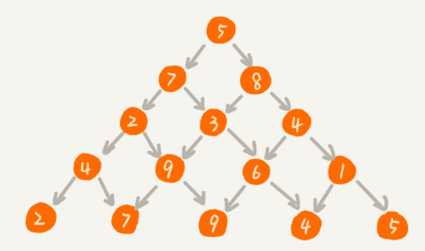

python实现代码：

```python
def yh_triangle(nums: List[List[int]]) -> int:
    n = len(nums)  # 层数
    memo = [0] * n
    memo[0] = nums[0][0]
    for i in range(1, n):
        for j in range(i, -1, -1):
            if j == i:
                memo[j] = memo[j - 1] + nums[i][j]
            elif j == 0:
                memo[j] += nums[i][j]
            else:
                memo[j] = min(memo[j - 1] + nums[i][j], memo[j] + nums[i][j])
    return min(memo)
```


## 硬币找零问题

假设有几种不同币值的硬币 v1，v2，……，vn（单位是元）。如果要支付 w 元，求最少需要多少个硬币。比如，有 1 元、3 元、5 元3 种不同的硬币，要支付 9 元最少需要 3 个硬币（3 个 3 元的硬币）。

**回溯算法分析思路：**

每次从v1~vn种取出1个硬币，n种选择对应n个状态，用变量记录当前选择决定的总金额，若当前状态下支付的金额大于等于w元时，则结束选择。否则继续下一次硬币选择。支付金额等于等于w元是，同时记录下当前所需的硬币数。

python代码（仅计算最小硬币数）：

```python
def coins_backtracking(values: List[int], target: int):
    global min_num
    min_num = sys.maxsize
    memo = set()

    def coins_backtracking_in(values: List[int], target: int, cur_value: int, coins_count: int):
        if cur_value == target:
            global min_num
            min_num = min(coins_count, min_num)
            return
        if (cur_value, coins_count) in memo: return
        memo.add((cur_value, coins_count))
        for n in values:
            ncv = cur_value + n
            if ncv <= target:
                coins_backtracking_in(values, target, ncv, coins_count + 1)

    coins_backtracking_in(values, target, 0, 0)
    return min_num
```

可获得硬币选取列表的python实现：

```python
def coins_backtracking(values: List[int], target: int):
    global min_num, min_coins_list
    min_num = sys.maxsize
    memo = set()
    coins_list = []
    min_coins_list = []

    def coins_backtracking_in(values: List[int], target: int, cur_value: int, coins_count: int):
        if cur_value == target:
            global min_num, min_coins_list
            if coins_count < min_num:
                min_num = coins_count
                min_coins_list = coins_list[:coins_count]
            return
        if (cur_value, coins_count) in memo: return
        memo.add((cur_value, coins_count))
        coins_list.append(0)
        for n in values:
            coins_list[coins_count] = n
            ncv = cur_value + n
            if ncv <= target:
                coins_backtracking_in(values, target, ncv, coins_count + 1)

    coins_backtracking_in(values, target, 0, 0)
    return min_coins_list
```


---

假设有几种不同币值的硬币 v1，v2，……，vn（单位是元）。要支付 w 元，求最少需要多少个硬币。

动态规划分析思路：

求支付w元最少需要多少个硬币，可以分解为求支付w-v1,w-v2,，……，w-vn元需要硬币数的最小值+1，

用memo[w+1]作为状态数组来记录支付x元，最少所需要的硬币数。

初始化支付0元需要0个硬币，即memo[0]=0.

然后以此状态为基础，依次计算出支付1元，支付2元，...，直到支付w元，最少需要的硬币数。

python代码：

```python
def coins_dp(values: List[int], w: int) -> int:
    # memo[i]表示w为i的时候，最少需要的硬币数
    memo = [0] * (w + 1)
    # 初始化支付0元需要0个硬币
    memo[0] = 0
    # 可选硬币列表从小到大排序
    values.sort()
    for i in range(1, w + 1):
        min_num = 99999  # 假设最大金额为100000
        # 假设values的值为n1,n2,n3,...
        # 故memo[i]=min(memo[i-n1], memo[i-n2], ...) + 1
        for n in values:
            if i - n < 0: break
            if min_num > memo[i - n]:
                min_num = memo[i - n]
        memo[i] = min_num + 1
    return memo[-1]
```

## 最长上升子序列

给定一个无序的整数数组，找到其中最长上升子序列的长度。

示例: [10,9,2,5,3,7,101,18]
输出: 4 
解释: 最长的上升子序列是 [2,3,7,101]，它的长度是 4。
说明: 可能会有多种最长上升子序列的组合，只需要输出对应的长度即可。


**暴力遍历思路：**

递归遍历所有增加的子序列，返回最长增加的子序列的最大长度。

递归函数lengthOfLIS_in将nums无序整数数组的pos位置的元素与前一个元素prev进行比较：

当nums[pos]>prev时，可以将prev包含在内，得出子序列 的最长上升子序列的长度。此外，还计算不将prev包含在内的子序列的最长上升子序列的长度。取两个长度中的最大值即可。
当nums[pos]<prev时，不能将prev包含在内。只计算不将prev包含在内的子序列的最长上升子序列的长度。

python代码：

```python
def lengthOfLIS(nums: List[int]) -> int:

    def lengthOfLIS_in(nums: List[int], prev: int, pos: int) -> int:
        if pos == len(nums): return 0
        taken = 0
        if nums[pos] > prev:
            taken = lengthOfLIS_in(nums, nums[pos], pos + 1) + 1
        no_taken = lengthOfLIS_in(nums, prev, pos + 1)
        return max(no_taken, taken)

    return lengthOfLIS_in(nums, -sys.maxsize - 1, 0)
```

加入缓存，避免避免冗余计算，python代码：

```python
def lengthOfLIS(nums: List[int]) -> int:
    n = len(nums)
    # memo用于避免冗余计算
    memo = [[-1] * n for _ in range(n + 1)]

    def lengthOfLIS_in(nums: List[int], prev_idx: int, pos: int) -> int:
        if pos == len(nums): return 0
        cache = memo[prev_idx + 1][pos] 
        if cache >= 0: return cache
        taken = 0
        if prev_idx == -1 or nums[pos] > nums[prev_idx]:
            taken = lengthOfLIS_in(nums, pos, pos + 1) + 1
        no_taken = lengthOfLIS_in(nums, prev_idx, pos + 1)
        result = max(no_taken, taken)
        memo[prev_idx + 1][pos] = result
        return result

    return lengthOfLIS_in(nums, -1, 0)
```

**动态规划思路：**

状态定义：dp[i]的值代表nums前i个数字的最长子序列长度。
转移方程：设 j∈[0,i)，考虑每轮计算新dp[i]时，遍历[0,i)列表区间，做以下判断：

1. 当nums[i] > nums[j]时： nums[i]可以接在 nums[j]之后，此时最长上升子序列长度为 dp[j] + 1；
2. 当 nums[i] <= nums[j]时： nums[i]无法接在 nums[j]之后，此情况上升子序列不成立，跳过。

dp[i]为情况1所有结果的最大值，若没有条件1的情况，则dp[i]=1

具体实现时，可将dp[i]所有元素置 1，含义是每个元素都至少可以单独成为子序列，此时长度都为1。
最后，返回dp 列表最大值，即可得到全局最长上升子序列长度。

大致过程：

 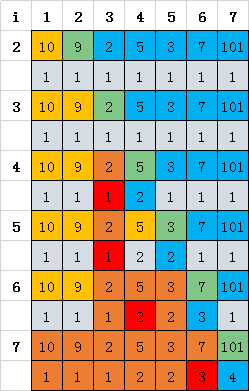

图中黄色表示不满足条件跳过的元素，绿色代表dp[i]中的i位置，红色表示在所有满足条件的找到的最大值。

python代码实现：

```python
def longest_increasing_subsequence(nums: List[int]) -> int:
    """
    状态定义：dp[i]的值代表nums前i个数字的最长子序列长度。
    转移方程：设 j∈[0,i)，考虑每轮计算新dp[i]时，遍历[0,i)列表区间，做以下判断：
     1.当nums[i]>nums[j]时：nums[i]可以接在 nums[j]之后，此时最长上升子序列长度为dp[j]+1；
     2.当 nums[i]<=nums[j]时：nums[i]无法接在 nums[j]之后，此情况上升子序列不成立，跳过。
    dp[i]为情况1所有结果的最大值，若没有条件1的情况，则dp[i]=1
    具体实现时，将dp[i]所有元素置1，含义是每个元素都至少可以单独成为子序列，此时长度为1。
    最后返回dp列表最大值，即可得到全局最长上升子序列长度。
    """
    n = len(nums)
    dp = [1] * n
    result = 1
    for i in range(1, n):
        for j in range(i):
            if nums[i] > nums[j]:
                dp[i] = max(dp[i], dp[j] + 1)
        if dp[i] > result: result = dp[i]
    return result
```

复杂度分析：
时间复杂度 $O(N^2)$：遍历计算 dp列表需 $O(N)$，计算每个 $dp[i]$ 需 $O(N)$。
空间复杂度 $O(N)$： dp列表占用线性大小额外空间。

---

**动态规划+2分搜索 优化时间复杂度：**

**状态定义：**tails[k]的值代表长度为k+1子序列的尾部元素值。

在遍历计算每个 tails[k]时，不断更新长度为[1,k]的子序列尾部元素值，始终保持每个尾部元素值最小 。

**转移方程：** 设 res为 tails当前长度，代表直到当前的最长上升子序列长度。

设i∈[0,res) ，每轮遍历出nums[k]时，有两种情况：

1. 区间中存在 tails[i] > nums[k]： 将第一个满足 tails[i] > nums[k]执行 tails[i] = nums[k]；因为更小的 nums[k]后更可能接一个比它大的数字。
2. 区间中不存在tails[i] > nums[k]：意味着 nums[k]可以接在前面所有长度的子序列之后，因此肯定是接到最长的后面（长度为len），新子序列长度为len+ 1。

由于tails列表是严格递增的,在tails数组搜索nums[k]时可以使用2分搜索。

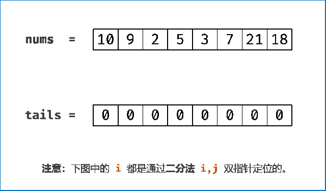

```python
def lengthOfLIS_by_binary_search(nums: [int]) -> int:
    tails, res = [0] * len(nums), 0
    for num in nums:
        low, high = 0, res - 1
        # 在tails数组中通过二分搜索查找num的插入位置
        # 可将该问题视为二分搜索的变体三：查找第一个大于等于num的元素位置，最终low的值即为插入点位置
        while low <= high:
            mid = (low + high) >> 1
            if tails[mid] >= num:
                high = mid - 1
            else:
                low = mid + 1
        tails[low] = num
        if low == res: res += 1
    return res
```

复杂度分析：
时间复杂度 $O(n\log n)$： 遍历 nums列表需 $O(n)$，每次在tails数组中二分搜索需$O(\log n)$。
空间复杂度  $O(n)$：tails 列表占用线性大小额外空间。

